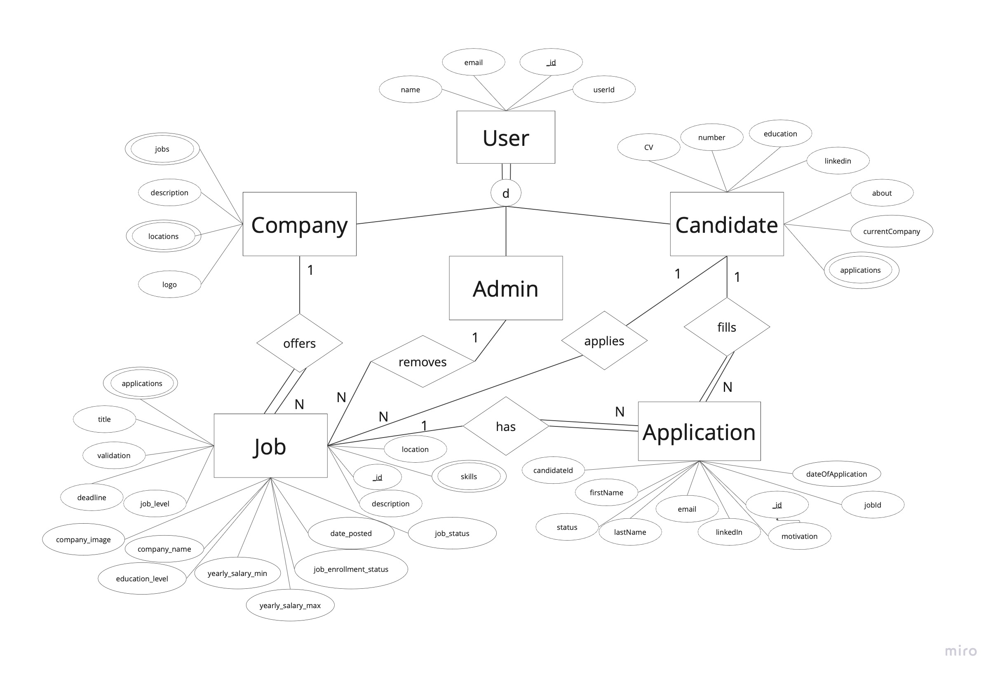
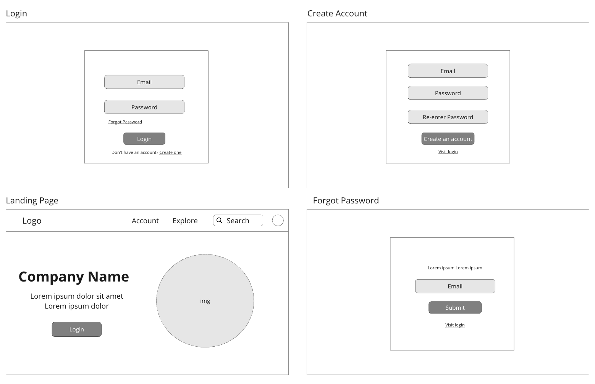
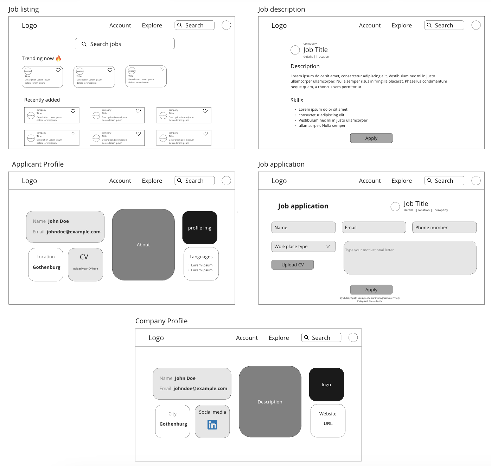

# Backend and Frontend Template

Latest version: https://git.chalmers.se/courses/dit342/group-00-web

## Project Structure

| File        | Purpose           | What you do?  |
| ------------- | ------------- | ----- |
| `server/` | Backend server code | All your server code |
| [server/README.md](server/README.md) | Everything about the server | **READ ME** carefully! |
| `client/` | Frontend client code | All your client code |
| [client/README.md](client/README.md) | Everything about the client | **READ ME** carefully! |
| [docs/DEPLOYMENT.md](docs/DEPLOYMENT.md) | Free online production deployment | Deploy your app online in production mode |
| [docs/LOCAL_DEPLOYMENT.md](docs/LOCAL_DEPLOYMENT.md) | Local production deployment | Deploy your app local in production mode |

## Requirements

The version numbers in brackets indicate the tested versions but feel free to use more recent versions.
You can also use alternative tools if you know how to configure them (e.g., Firefox instead of Chrome).

* [Git](https://git-scm.com/) (v2) => [installation instructions](https://www.atlassian.com/git/tutorials/install-git)
  * [Add your Git username and set your email](https://docs.gitlab.com/ce/gitlab-basics/start-using-git.html#add-your-git-username-and-set-your-email)
    * `git config --global user.name "YOUR_USERNAME"` => check `git config --global user.name`
    * `git config --global user.email "email@example.com"` => check `git config --global user.email`
  * > **Windows users**: We recommend to use the [Git Bash](https://www.atlassian.com/git/tutorials/git-bash) shell from your Git installation or the Bash shell from the [Windows Subsystem for Linux](https://docs.microsoft.com/en-us/windows/wsl/install-win10) to run all shell commands for this project.
* [Chalmers GitLab](https://git.chalmers.se/) => Login with your **Chalmers CID** choosing "Sign in with" **Chalmers Login**. (contact [support@chalmers.se](mailto:support@chalmers.se) if you don't have one)
  * DIT342 course group: https://git.chalmers.se/courses/dit342
  * [Setup SSH key with Gitlab](https://docs.gitlab.com/ee/ssh/)
    * Create an SSH key pair `ssh-keygen -t ed25519 -C "email@example.com"` (skip if you already have one)
    * Add your public SSH key to your Gitlab profile under https://git.chalmers.se/profile/keys
    * Make sure the email you use to commit is registered under https://git.chalmers.se/profile/emails
  * Checkout the [Backend-Frontend](https://git.chalmers.se/courses/dit342/group-00-web) template `git clone git@git.chalmers.se:courses/dit342/group-00-web.git`
* [Server Requirements](./server/README.md#Requirements)
* [Client Requirements](./client/README.md#Requirements)

## Getting started

```bash
# Clone repository
git clone git@git.chalmers.se:courses/dit342/group-05-web.git

# Change into the directory
cd group-05-web

# Setup backend
cd server && npm install
npm run dev

# Setup frontend
cd client && npm install
npm run serve
```

> Check out the detailed instructions for [backend](./server/README.md) and [frontend](./client/README.md).

## Visual Studio Code (VSCode)

Open the `server` and `client` in separate VSCode workspaces or open the combined [backend-frontend.code-workspace](./backend-frontend.code-workspace). Otherwise, workspace-specific settings don't work properly.

## System Definition (MS0)

### Purpose

Description

The **purpose** of this system is to provide a service of job searching in IT that joins companies and candidates together, by allowing companies to post job offerings and candidates to apply for them digitally. It includes a **searching mechanism** that makes it easier to find specific job offers. The system provides job offerings to all unemployed people **(target audience)** within the IT industry. The system is also regulated by the administrators.
The **stakeholders** of the job searching system are unemployed people, developers, Hiring Managers of companies, administrators of the system, companies(employers), Skatteverket, Government.
### Pages

#### (Unlogged-in flow)
* **Login page**: this page displays fields for entering a username and a password, allowing users to authenticate themselves and access their accounts.
* **Account creating**: this page displays fields for entering a username, and email, and password, as well as the specific attributes of either an applicant or a company (logo, locations or CV). Enables account creation for new users.
* **Password retrieval**: this page displays fields for users to enter their registered email. This allows them to retrieve their password, by receiving a link for resetting their forgotten password.

#### (Logged-in flow)
* **Landing page**: this page displays a landing image and message, shows featured job listings, and a search bar. It allows applicants to start job hunting fairly quickly after logging in.
* **Account page**: this page displays the applicant's or company's personal information. Depending on which, it will also show the uploaded resume and application history, or the uploaded job offerings, allowing the users to change these.
* **Job listing page**: this page features job vacancies as according to the searching criteria specified by the applicant. It allows applicants to find the jobs they are looking for and to launch the application process.
* **Job description page**: this page displays all the information regarding a specific job offering, such as the title and description, the requirements and the deadline. It also displays the fields to be filled-in by the candidates, allowing them to apply directly for the job opening from the page.

### Entity-Relationship (ER) Diagram



### System wireframe
This is the mockup of the UI of the job searching website containing the necessary pages required. In further development the UI will be improved and functionality implemented. 




## Teaser (MS3)